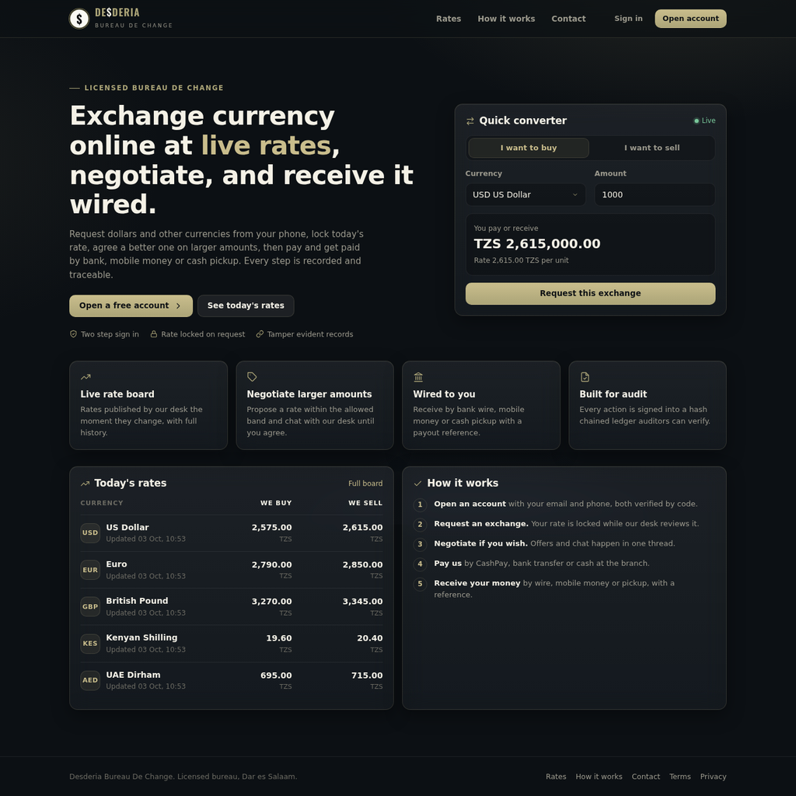
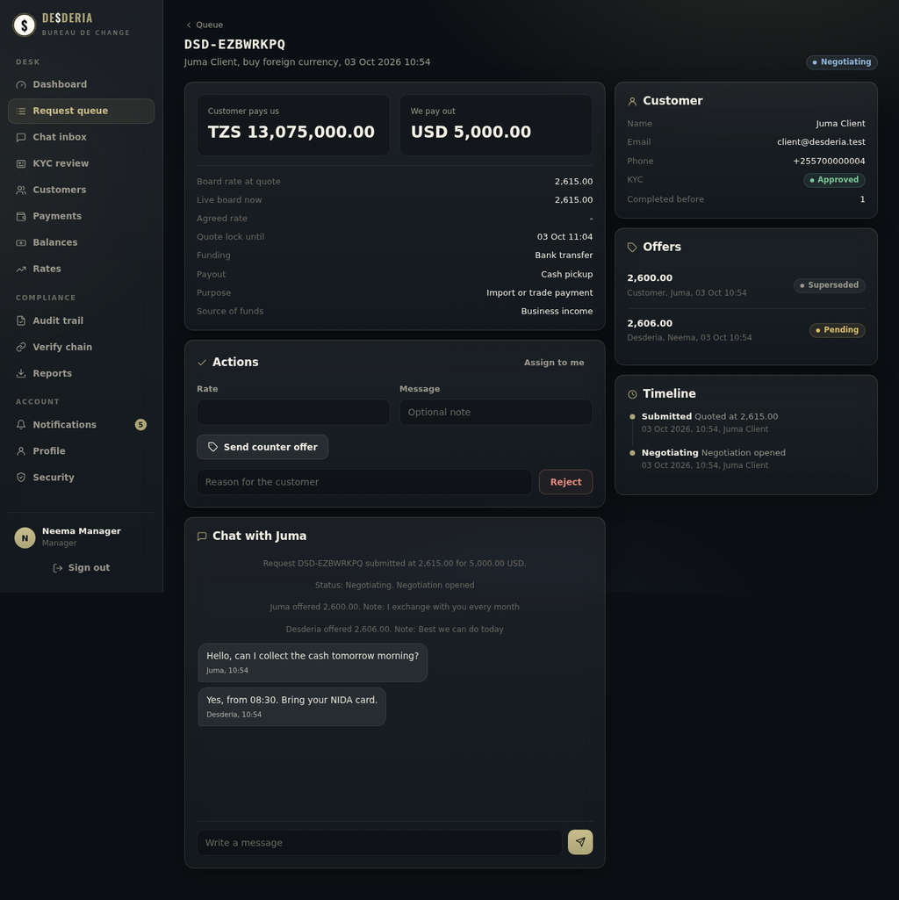
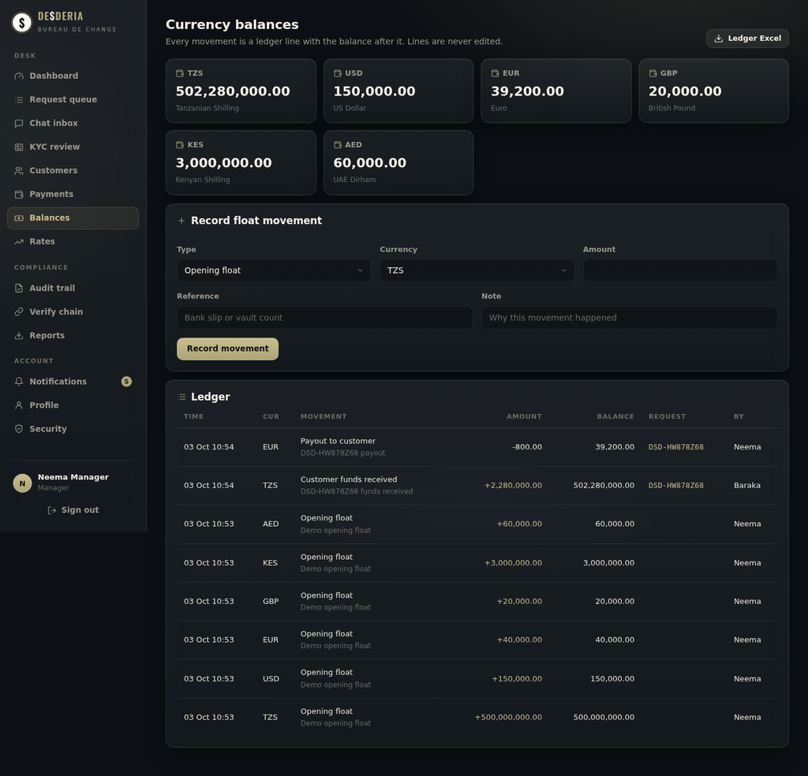
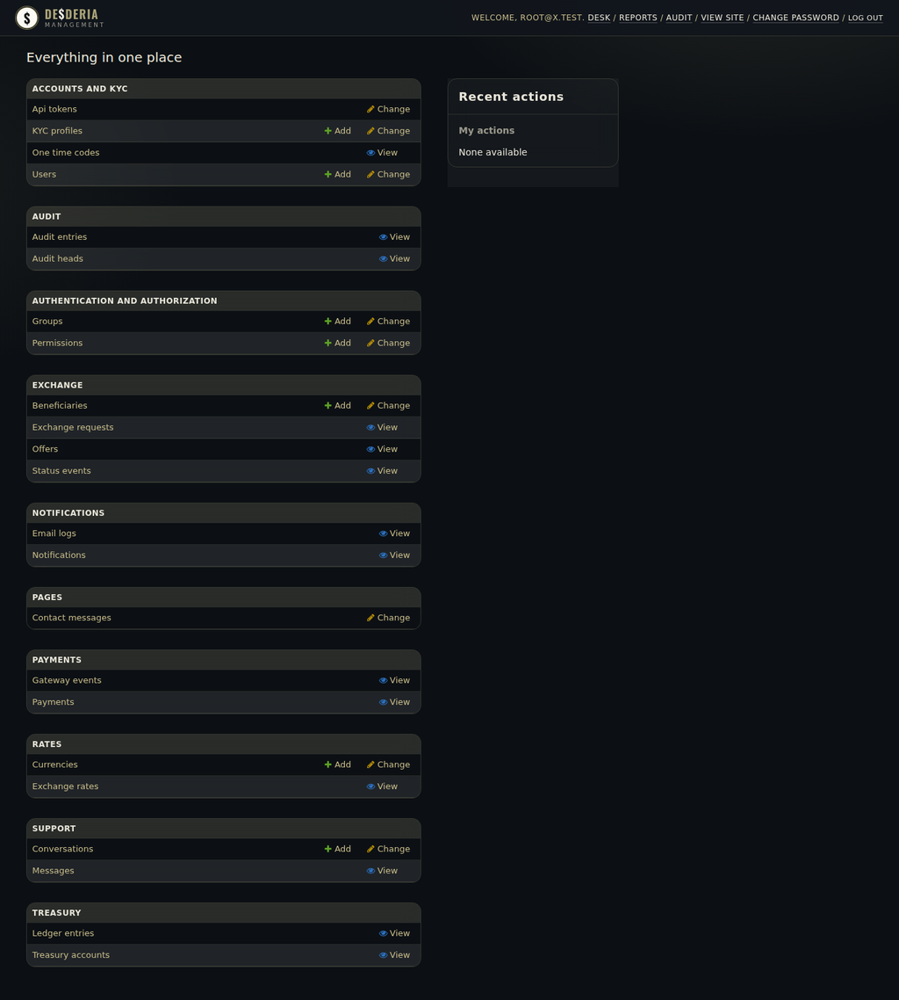
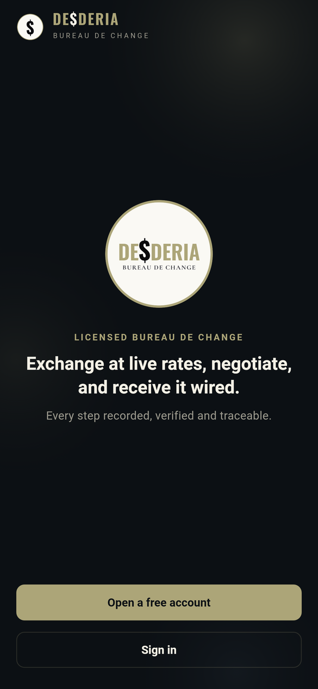
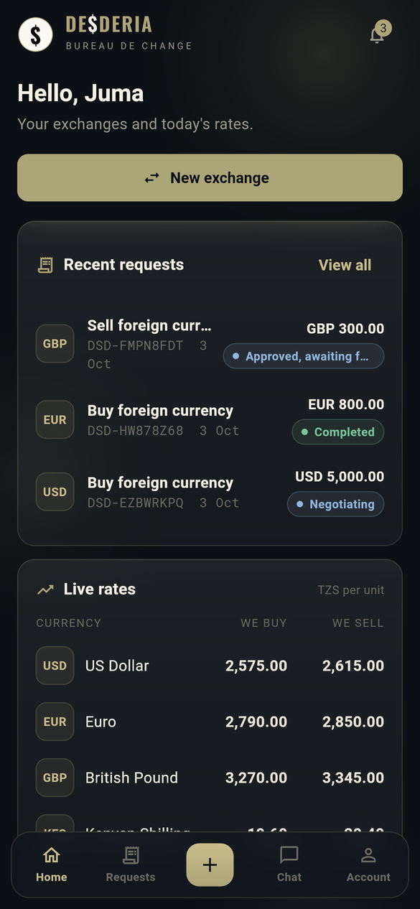
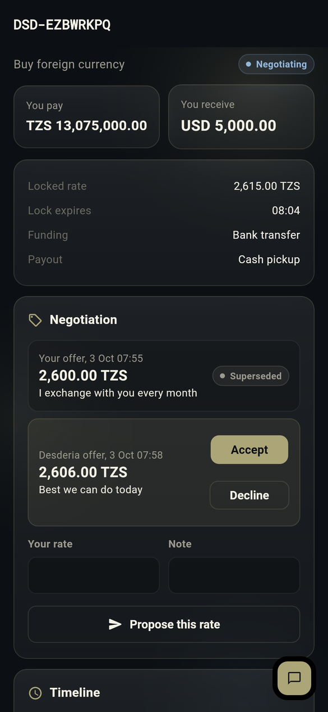
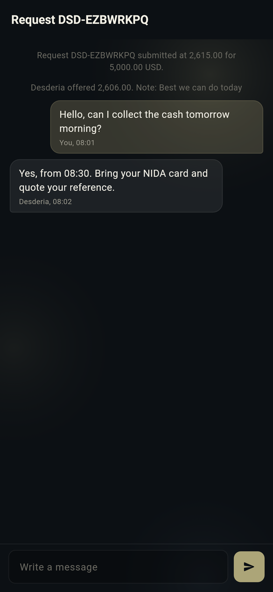

# Desderia Bureau De Change

Two deliverables, one platform:

| File | What it is |
|---|---|
| `desderia_web.zip` | Django 5.2 web app, staff desk, management portal and the REST API the mobile app uses |
| `desderia_mobile.zip` | Flutter app for Android and iOS (customer app) |
| `Desderia_User_Guide.pdf` | Illustrated step by step guide: website, sign in, customer area, mobile app, staff desk, audit and the management panel |

Unzip each and start with its `README.md`. Inside the web project:

- `README.md`: setup, security, deployment
- `API.md`: how the mobile app connects to the server
- `OPERATIONS.md`: how the bureau runs day to day on both apps

## What it does

Customers open an account with email and phone (both verified by code), sign in with password plus a one time code, request currency at the live rate (locked while the desk reviews), negotiate larger amounts, pay by CashPay (USSD prompt to M-Pesa, Mixx by Yas or Airtel Money), bank transfer or cash, and receive by bank wire, mobile money or cash pickup. Every request has its own chat with the desk, every status change is emailed, and every action lands in a hash chained audit trail.

Staff work from the desk: queue, approvals, counter offers, funds confirmation, payouts with dual control, KYC review, rate publishing, currency balances and ledger, chat inbox, and branded Excel reports. Administrators manage everything at `/management/`.

## Screenshots

Web, public home

Web, desk request with negotiation and chat

Web, currency balances and ledger

Management portal at /management/

Mobile app: welcome, home, request detail, chat

   
